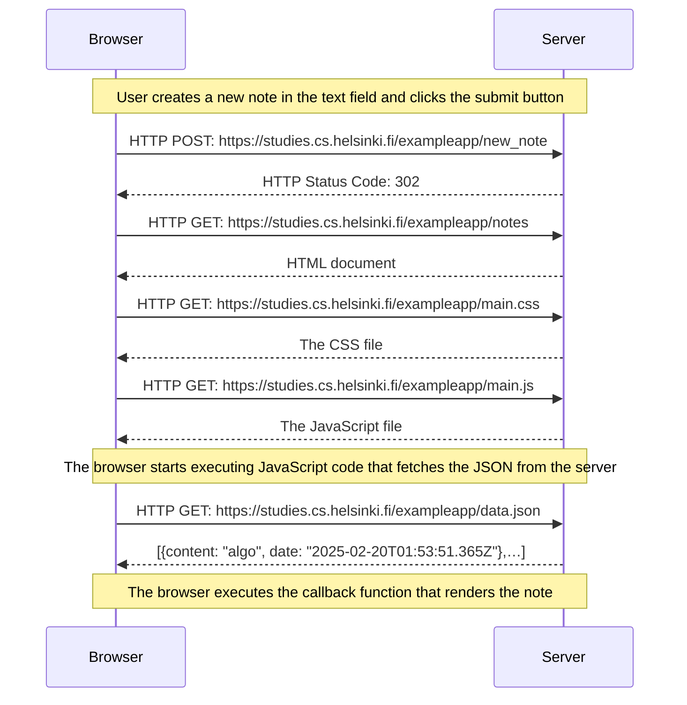

```mermaid
    sequenceDiagram
    Participant B as Browser
    Participant S as Server
    Note over B,S: User creates a new note in the text field and clicks the submit button   
    
    B ->> S: HTTP POST: https://studies.cs.helsinki.fi/exampleapp/new_note
    S -->> B: HTTP Status Code: 302
    B ->> S: HTTP GET: https://studies.cs.helsinki.fi/exampleapp/notes
    S -->> B: HTML document
    B ->> S: HTTP GET: https://studies.cs.helsinki.fi/exampleapp/main.css
    S -->> B: The CSS file
    B ->> S: HTTP GET: https://studies.cs.helsinki.fi/exampleapp/main.js
    S -->> B: The JavaScript file
    Note over B,S: The browser starts executing JavaScript code that fetches the JSON from the server 
    B ->> S: HTTP GET: https://studies.cs.helsinki.fi/exampleapp/data.json
    S -->> B: [{content: "algo", date: "2025-02-20T01:53:51.365Z"},…]
    Note over B,S: The browser executes the callback function that renders the note

``` 