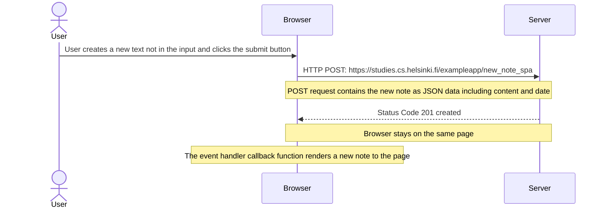

```mermaid
    sequenceDiagram
      Actor User
      Participant B as Browser
      Participant S as Server
    

    User ->> B: User creates a new text not in the input and clicks the submit button
    B ->> S: HTTP POST: https://studies.cs.helsinki.fi/exampleapp/new_note_spa
    Note over B,S: POST request contains the new note as JSON data including content and date

    S -->> B: Status Code 201 created
    Note over B,S: Browser stays on the same page
   Note over B: The event handler callback function renders a new note to the page 
  

``` 